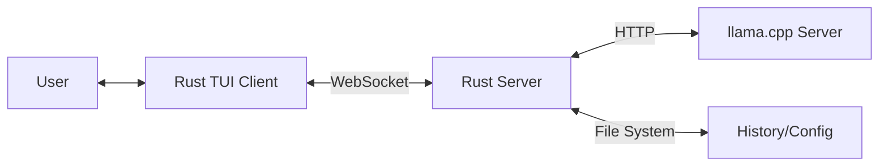

# System Architecture

## Overview
This project is a local-first chat application powered by `llama.cpp`. It uses a Client-Server architecture to decouple the User Interface from the Inference Engine, allowing for flexibility and performance.

### High-Level Design

## Technology Stack

### Core
*   **Language**: Rust (2021 Edition)
*   **Async Runtime**: `tokio`

### Server (`/server`)
*   **Purpose**: Acts as the backend API and middleware.
*   **Responsibilities**:
    *   Manages the lifecycle of the `llama-server`.
    *   Exposes a WebSocket API for clients.
    *   Persists conversation history.
    *   Sanitizes and formats prompts for the LLM.
*   **Key Crates**: `tokio`, `serde`, `reqwest` (or similar for HTTP), `anyhow`/`thiserror`.

### Client (`/client`)
*   **Purpose**: Terminal User Interface (TUI) for the end user.
*   **UI Library**: `ratatui` (Community fork of `tui-rs`).
*   **Responsibilities**:
    *   Renders the conversation state.
    *   Handles user input.
    *   Manages WebSocket connection state.
*   **Key Crates**: `ratatui`, `crossterm`, `tokio-tungstenite` (or similar for WS).

### Inference Engine
*   **Software**: `llama.cpp`'s `llama-server`.
*   **Communication**: HTTP API (Standard OAI-compatible or native).

## Design Principles

1.  **Local-First**: No data leaves the user's machine. All inference and storage are local.
2.  **Privacy**: Respect user data. Default to encryption/secure storage where applicable (future).
3.  **Performance**: The TUI should be instant. Latency should only come from LLM inference time.
4.  **Simplicity**: Clear separation of concerns to allow easy refactoring (e.g., swapping the Client for a GUI later).

## Development Conventions
*   **Error Handling**: Libraries use `thiserror` to define precise errors. Applications use `anyhow` for easier error propagation.
*   **Code Style**: Standard `rustfmt` and `clippy` (warn level).
*   **Documentation**: Public APIs must have rustdoc comments.
